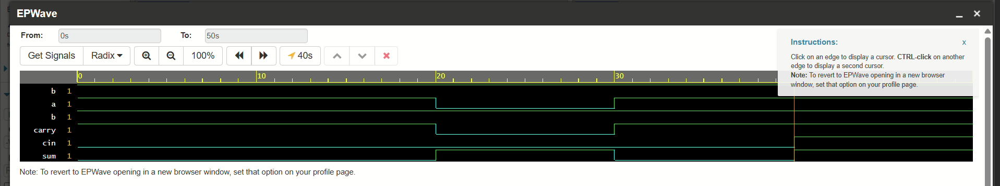

# 4-Bit Ripple Carry Adder — Verilog

A 4-bit Ripple Carry Adder (RCA) designed in Verilog HDL, built by cascading four 1-bit Full Adder modules. Verified using a custom testbench and simulated waveform analysis.

## 📌 Overview

A Ripple Carry Adder is one of the most fundamental building blocks in digital arithmetic circuits, used inside ALUs, processors, and embedded systems to perform binary addition. This project implements a 4-bit RCA by chaining Full Adders together, where the carry-out of each stage becomes the carry-in of the next.

## ⚙️ How It Works

- Each **Full Adder** takes two input bits (`a`, `b`) and a carry-in (`cin`), producing a `sum` and `cout`.
- Four Full Adders are cascaded to add two 4-bit numbers (`A[3:0]`, `B[3:0]`) along with an initial carry-in (`Cin`).
- The carry "ripples" sequentially from the least significant bit to the most significant bit, hence the name.

## 🧰 Techniques Used

- **Structural Modeling** – Built by instantiating the Full Adder module 4 times and cascading carry signals.
- **Gate-Level Design** – Full Adder logic implemented directly with XOR, AND, and OR gates.
- **Testbench Development** – Self-checking testbench applying multiple input combinations.
- **Waveform Simulation** – Verified signal propagation and carry ripple behavior using EDA Playground.

## 📂 Files

| File | Description |
|---|---|
| `full_adder.v`| Design file containing Full Adder|
| `ripple_carry_adder.v` | Design file containing  4-bit RCA modules |
| `testbench.v` | Testbench to simulate and verify the design |
| `waveform.png` | Simulation waveform output |

## ▶️ How to Run

1. Copy `ripple_carry_adder.v` and `testbench.v` into [EDA Playground](https://www.edaplayground.com/) (or any Verilog simulator like ModelSim/Vivado/Icarus Verilog)
2. Set the testbench as the top module
3. Run simulation
4. View waveform output in EPWave / GTKWave

## 📊 Sample Output

## 🎯 Key Learning

This project reinforced how basic logic gates combine to perform binary arithmetic, and highlighted the **propagation delay bottleneck** in Ripple Carry Adders — motivating faster architectures like Carry Look-Ahead Adders used in real-world processors.

## 👤 Author

*(Jeevalaharini M R)* — feel free to connect or reach out with feedback!
